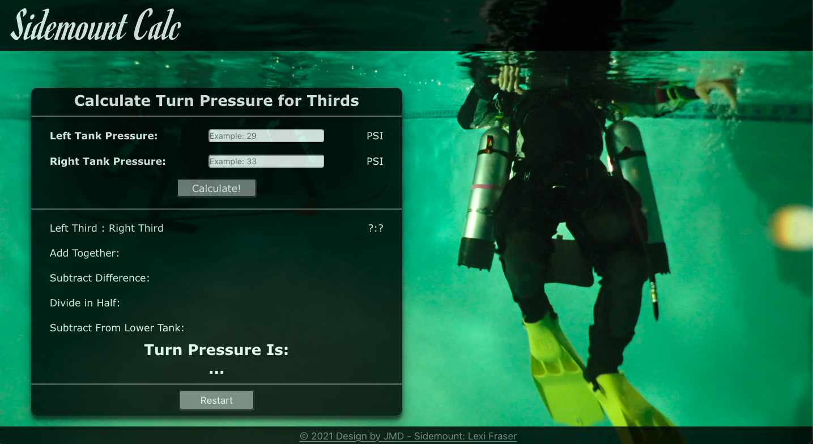

# Sidemount Calc

This is a tool to help divers learning air management for sidemount diving. [Check out the website here!](https://www.sidemountcalc.com)

## Table of Contents

- [Overview](#overview)
    - [App Breakdown](#app-breakdown)
    - [Screenshot](#screenshot)
    - [Links](#links)
- [My Process](#my-process)
    - [Built With](#built-with)
    - [What I Learned](#what-i-learned)
    - [Continued Development](#continued-development)
    - [Useful Resources](#useful-resources)

    ## Overview

    ### App Breakdown

    This app is built to help sidemount divers for when they would like to practice calculating turn pressure for thirds.

    The diver enters their starting pressures for each tank, left and right, in a simplified form. 

    *For example, if I'm starting with 2960psi and 3120psi, I would enter 29 and 31.*

    The app will then let you begin calculating thirds step by step. Because it's step by step, you can try to come up with the solution for each step before seeing it.

    You will be alerted for using the calculator with un-safe calculations, but will be allowed to continue. 

    *For example, you will be alerted if your starting tank pressure is less than 1500psi.*

    Once finished, you can restart and test yourself again. 

    ### Screenshot

    

    ### Links

    - [Github Repo](https://github.com/JohnMichaelD/Sidemount-Gas-Calculator)
    - [Live View](www.sidemountcalc.com)
    - [Personal Website](https://johnmichaeld.github.io/portfolio/)
    - [Scuba Calc Source](https://www.instagram.com/sfsidemountvan/?utm_medium=copy_link)

    ## My Process

    ### Built With

    - ReactJs
    - Javascript ES6
    - HTML5
    - CSS3

    ### What I Learned

    This was my first time using react and npm.

    ### Continued Development

   - I would like to continue with react, and keep building more projects using react.

    - I would like to update the application to accept both **bar** and **psi** pressure inputs.

    - I would also like to add the ability to calculate for sixths and other sidemount or tech related calculations. 

    - I would like to push this into a mobile app, so you can access it offline and practice wherever and whenever.

    - I'm currently having issues pushing this react app to show on github pages. 

    - I would like to add more pages, including instructions, an about, and maybe more calculators.

    ### Useful Resources
    
    - [React App to Github Pages](https://dev.to/yuribenjamin/how-to-deploy-react-app-in-github-pages-2a1f)